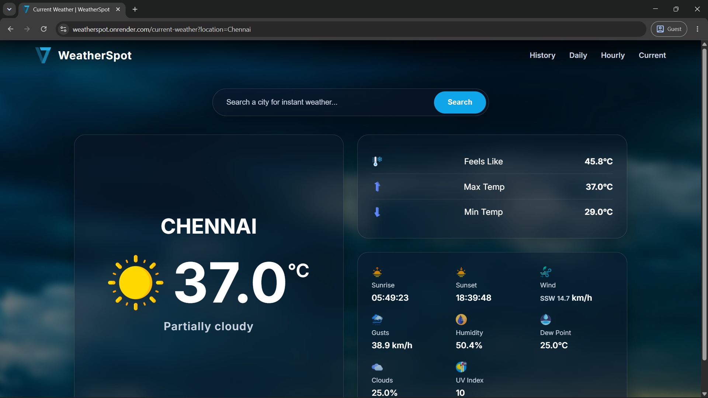
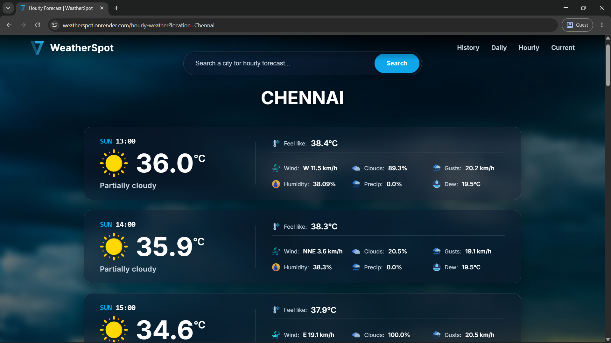
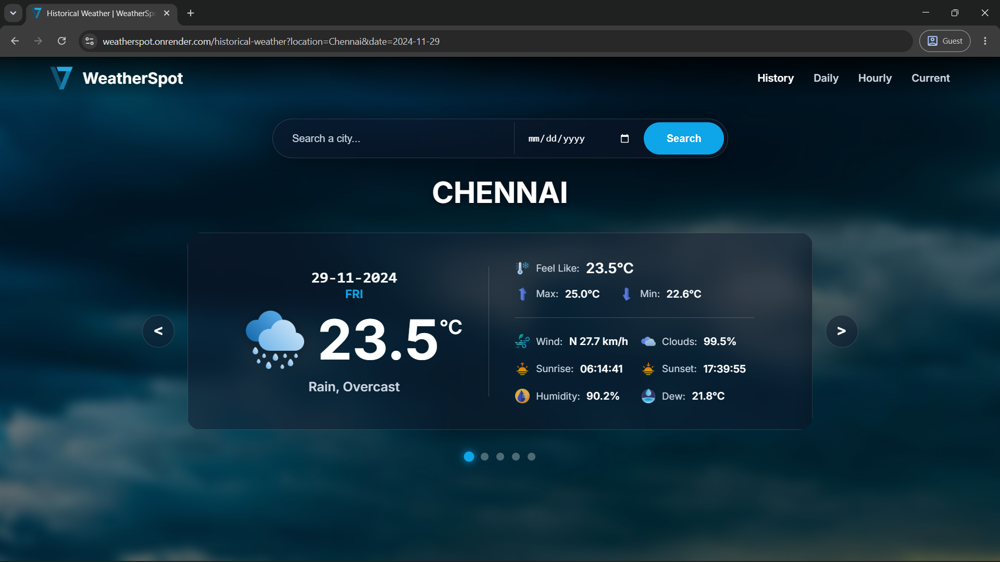

# 🌤️ WeatherSpot

WeatherSpot is a comprehensive, premium-designed weather application built with Spring Boot and Thymeleaf. It provides real-time weather conditions, 15-day forecasts, and deep historical weather data wrapped in a modern, responsive Glassmorphism UI.

🚀 **Live Demo:** https://weatherspot.onrender.com

---

## 📸 Screenshots

<p align="center">
  
  &nbsp;
  
</p>
<p align="center">
  
</p>

---

## ✨ Features

* **Current Weather:** View real-time weather conditions instantly.
* **Hourly Forecast:** Check highly detailed weather data for the next 24 hours.
* **15-Day Forecast:** Plan ahead with daily high/lows and conditions for the next 15 days.
* **Historical Weather:** Search historical weather data from 1973 to the present day using a custom interactive slider.
* **Detailed Metrics:** Tracks temperature, max/min temp, dew point, humidity, conditions, sunrise/sunset, wind direction/gusts, UV index, cloud cover, and "feels like" temperature.
* **Premium UI:** Fully responsive, frosted-glass (Glassmorphism) design that adapts seamlessly to desktop, tablet, and mobile displays.

---

## 🛠️ Built With

* **Backend:** Java 17, Spring Boot
* **Frontend:** HTML5, CSS3 (Grid/Flexbox), Vanilla JavaScript, Thymeleaf
* **External APIs:** [Visual Crossing Weather API](https://www.visualcrossing.com/), Location API
* **Deployment:** Docker, Render

---

## 💻 Getting Started (Local Development)

Follow these instructions to get a copy of the project up and running on your local machine.

### Prerequisites

* Java 17 or higher
* Maven 3.6.3 or higher
* Git
* **API Keys:** You will need your own free API keys from Visual Crossing.

### 1. Clone the Repository

```bash
git clone https://github.com/Ramalingam-N/Blog-Zone.git
cd Blog-Zone

```

### 2. Configure API Keys (Environment Variables)

For security, API keys are not hardcoded into this repository. You must provide your own keys to run the application locally.

Open `src/main/resources/application.properties` and note the required variables:

```properties
spring.application.name=WeatherSpot
server.port=8080

visualcrossing.api-key-1=${VISUALCROSSING_API_KEY_1}
visualcrossing.api-key-2=${VISUALCROSSING_API_KEY_2}
visualcrossing.api-key-3=${VISUALCROSSING_API_KEY_3}
location.api-key=${LOCATION_API_KEY}

```

**How to set these locally:**
You can set these as system environment variables on your machine, or temporarily replace the `${VARIABLE_NAME}` placeholders in your local `application.properties` with your actual API keys.

> **Important:** If you replace the placeholders with your real keys, ensure you **do not** commit those changes to GitHub, or your keys will be exposed to the public.

### 3. Build the Project

```bash
mvn clean install

```

### 4. Run the Application

Start your Spring Boot application by running:

```bash
mvn spring-boot:run

```

### 5. Access the Application

Open your browser and navigate to:
`http://localhost:8080`

---

## 💡 Things to Note

* **Data Limitations:** For some global locations, historical data might be available only until 2010 due to limitations in the upstream weather data provided by the API.
* **API Rate Limits:** Visual Crossing free tiers have daily query limits. The app is configured to handle multiple keys (`api-key-1`, `api-key-2`, etc.) to balance the load and prevent rate-limiting during heavy testing.

## 🤝 Feedback & Contributions

Feel free to fork the project, open an issue, or submit a pull request. Your feedback and contributions are highly valued!

## 🎉 Acknowledgements

* Thanks to the **Visual Crossing** team for their comprehensive weather data API.
* Designed and developed by [N Ramalingam](https://www.google.com/search?q=https://github.com/Ramalingam-N).
